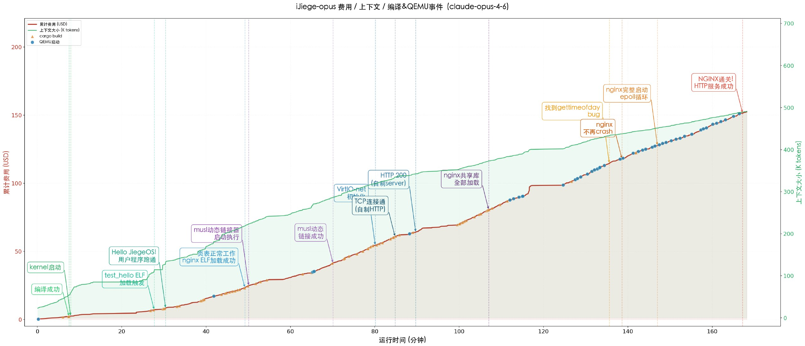

# iJiegeOS

[English version](./README.md)

一个完全由 Claude Code 自主实现的 Rust 操作系统内核——刚刚好能够在 QEMU 上运行真实的 Linux nginx web 服务器。

两次实验，两个模型，同一个目标：

| 分支 | 模型 | 耗时 | 成本 |
|------|------|------|------|
| [opus](https://github.com/wangrunji0408/iJiegeOS/tree/opus) | Claude Opus 4.6 | ~2小时46分 | ~? |
| [sonnet](https://github.com/wangrunji0408/iJiegeOS/tree/sonnet) | Claude Sonnet 4.6 | ~16 小时 | ~$60 |

## 提示词

```
你是智能杰哥。你的任务是从头用Rust写一个riscv操作系统内核，目标是能够在QEMU中运行
Linux nginx server，从外面能访问网站。必须运行nginx官方binary，不能自行修改目标。
请自行设计实现，不要问我任何问题，我不会给你答复或提供帮助。你拥有所有权限，包括上网
查资料，但必须在当前目录下工作。你需要一直干活直到目标实现为止。
```
⏵⏵ bypass permissions on

## 时间线

### Opus 4.6 — 2小时46分



Claude Code 全程运行约 **2小时46分钟**，中途没有人工介入。

| 时长  | 里程碑 |
|-------|--------|
| 00:02 | 项目骨架 + 链接脚本创建完成 |
| 00:25 | nginx 完成初始化，写 PID 文件 |
| 01:22 | nginx 成功运行！进入 epoll 事件循环 |
| 02:21 | TCP 连接建立，nginx 收到 HTTP 请求 |
| 02:45 | 修复 virtio-net 接收 + epoll data 指针 bug |
| 02:46 | nginx 成功返回 HTTP 200 🎉 |

### Sonnet 4.6 — 16 小时

Claude Code 全程运行共 16 小时，中途没有人工介入。总成本约 60 美元。

| 时长  | 里程碑 |
|-------|--------|
| 01:27 | 内核成功启动 + VirtIO 网卡初始化 |
| 02:07 | musl ld 成功加载 nginx ELF |
| 05:00 | nginx 完成初始化，写 PID 文件 |
| 06:18 | TCP 三次握手成功，curl 能连到 8080 |
| 06:24 | nginx 成功 fork 出 worker 进程 |
| 08:40 | worker 进入 epoll 事件循环 |
| 09:30 | curl 首次建立 TCP 连接（Empty reply） |
| 10:00 | curl 首次收到响应（Connection reset） |
| 16:00 | nginx 成功返回 HTTP 200，欢迎页完整响应 🎉 |

两个分支的 Git 历史均从 Claude Code 会话日志完整导出。

## 效果演示

```
$ ./run.sh
$ curl http://127.0.0.1:8080/
```

## 项目背景

2019年，杰哥在操作系统课上首次[在 rCore 上成功运行 Nginx](https://jia.je/programming/2019/03/08/running-nginx-on-rcore/)，从此"杰哥"成为我们心中系统能力巅峰的象征。我们曾以手撸 OS 内核为傲，坚信这是人类创造力与执行力的独特证明。然而 AI 的进化不断突破想象，"智能杰哥"已近在眼前。于是我做了这场实验：让最先进的编程智能体重走长征路，复现杰哥当年的壮举。结果证明，这类目标明确的系统开发任务，人类已彻底不敌AI。~~OS 已经彻底倒闭了。~~

只要敢想敢干，你我皆是杰哥。

## License

MIT
