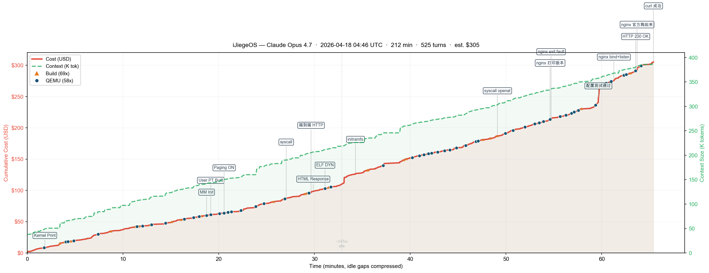

# iJiegeOS

[中文版](./README-CN.md)

A Rust OS kernel autonomously implemented by Claude Code — just barely capable of running a real Linux nginx web server on QEMU.

Three runs, multiple models, same goal:

| Branch | Model | Duration | Cost |
|--------|-------|----------|------|
| [opus-4.7](https://github.com/wangrunji0408/iJiegeOS/tree/opus-4.7) | Claude Opus 4.7 | ~65min | — |
| [opus-4.6](https://github.com/wangrunji0408/iJiegeOS/tree/opus-4.6) | Claude Opus 4.6 | ~2h 46min | — |
| [sonnet](https://github.com/wangrunji0408/iJiegeOS/tree/sonnet) | Claude Sonnet 4.6 | ~16 hours | ~$60 |

## Prompt

```
You are the AI-Jiege. Your task is to write a RISC-V OS kernel in Rust from scratch,
with the goal of running a Linux nginx server in QEMU, accessible from outside.
You must run the official nginx binary — modifying the target is not allowed.
Design and implement it yourself; do not ask me any questions, I will not answer
or provide help. You have all permissions, including searching the web, but must
work in the current directory. Keep working until the goal is achieved.
```

⏵⏵ bypass permissions on

## Timeline

### Opus 4.7 — 65min active (3h 32min total)



Claude Code ran for **~65 minutes**.

| Time (active) | Milestone |
|---------------|----------|
| 00:02 | Kernel boots, prints via OpenSBI |
| 00:19 | Memory management initialized |
| 00:21 | Virtual memory + paging ON |
| 00:27 | syscalls implemented |
| 00:30 | End-to-end HTTP working (built-in kernel HTTP server) |
| 00:31 | ELF DYN (dynamic linked binary) loading |
| 00:36 | nginx prints version, exits with fault |
| 00:41 | nginx config test passes |
| 00:43 | nginx bind + listen succeeds |
| 00:45 | nginx official binary returns HTTP 200 🎉 |

### Opus 4.6 — 2h 46min


Claude Code ran for **~2h 46min**.

| Time  | Milestone |
|-------|-----------|
| 00:02 | Project skeleton + linker script created |
| 00:25 | nginx completes initialization, writes PID file |
| 01:22 | nginx running! Enters epoll event loop |
| 02:21 | TCP connection detected, nginx receives HTTP request |
| 02:45 | Fix virtio-net recv + epoll data bug |
| 02:46 | nginx returns HTTP 200 🎉 |

### Sonnet 4.6 — 16 hours

Claude Code ran for **16 hours** with no human intervention. The total cost was approximately $60.

| Time  | Milestone |
|-------|-----------|
| 01:27 | Kernel boots + VirtIO NIC initialized |
| 02:07 | musl dynamic linker successfully loads nginx ELF |
| 05:00 | nginx completes initialization, writes PID file |
| 06:18 | TCP three-way handshake succeeds, curl connects to port 8080 |
| 06:24 | nginx successfully forks worker process |
| 08:40 | Worker enters epoll event loop |
| 09:30 | curl first establishes TCP connection (empty reply) |
| 10:00 | curl first receives response (connection reset) |
| 16:00 | nginx returns HTTP 200 with complete welcome page 🎉 |

The git history for both branches is a complete record exported from Claude Code session logs.

## Demo

```
$ ./run.sh
$ curl http://127.0.0.1:8080/
```

## Background

In 2019, Jiege was the first to [successfully run nginx on rCore OS](https://jia.je/programming/2019/03/08/running-nginx-on-rcore/), a Rust OS built from scratch. The achievement became legendary in our community — "Jiege" turned into a symbol of peak systems engineering, the kind of thing humans take pride in being able to do. We wore our ability to hand-craft OS kernels as a badge of honor, convinced it was proof of a uniquely human creativity and drive. Then AI kept raising the bar, and "AI-Jiege" started to feel inevitable. So I ran this experiment: have the most advanced coding agent of our time retrace that legendary journey and reproduce what Jiege once pulled off. The result: for well-defined systems tasks like this, humans simply cannot compete with AI anymore. ~~OS is finished.~~

Dare to try, and anyone can be Jiege.

## License

MIT
